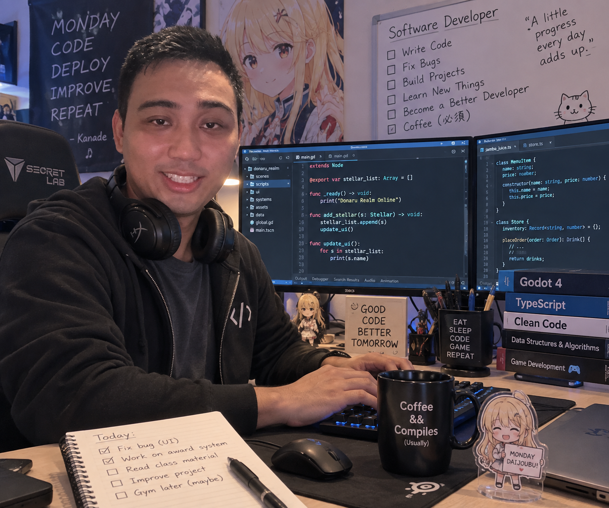

# From Curiosity to Software Engineering

## The Beginnings...

My interest in software engineering did not suddenly appear when I entered college. I have been interested in programming and creating things with computers since I was young.

I first experimented with programming when I was around eight years old using Flash ActionScript. I did not really understand what I was doing yet. Most of the time, I was copying and pasting code from online tutorials and seeing what happened. Still, it introduced me to the idea that I could tell a computer what to do by writing code.

Later, I became interested in RPG Maker. It gave me another way to combine programming with something else I enjoyed: creating games. Instead of only playing games, I could experiment with making my own systems, characters, and worlds.

My creative interests also extend beyond programming. I enjoy digital and traditional drawing, which gives me another way to create things. Software engineering and art might seem like completely different fields, but I think they share an important idea: you start with something that does not exist yet and slowly build it.

## The Future
In the future, I want to develop more than just my programming skills. Of course, I want to be able to create software through my own sweat, blood, and tears, but being a software engineer requires more than knowing how to write code. I also want to improve my teamwork, critical thinking, communication, and problem-solving skills.

First of all, working with other programmers is especially important to me. Most of my personal projects have allowed me to make decisions on my own, but professional software development requires people to work together. I want to learn how to communicate my ideas clearly, understand another programmer's code, accept feedback, divide responsibilities, and contribute to a project as part of a team.

I also want to become better at working under pressure. Bugs do not always appear at convenient times, and deadlines will not wait until everything is perfect. I want to learn how to stay focused when something goes wrong, identify the problem, think about possible solutions, and keep moving forward instead of immediately giving up.

Most importantly, I want to continue developing my problem-solving skills. Programming has taught me that there is rarely only one way to solve a problem. Sometimes my first solution works. Sometimes it fails completely. Sometimes fixing one bug somehow creates three more bugs (I hate it when that happened). What matters is being willing to understand what went wrong and try again.

I started programming as a kid who copied ActionScript from tutorials just to see what would happen. Now, I am learning how software is actually designed and developed. In the future, I hope to become someone who can take an idea, work with others to solve the problems along the way, and turn that idea into software that actually works.

<figcaption>
  
  <small>
    AI-generated image created with ChatGPT using the prompt:
    "Generate me an image of me being a software developer."
  </small>
</figcaption>

<blockquote>
  <strong>AI Disclaimer:</strong>
  AI was used for spelling corrections, grammar corrections and image generation. The ideas and content are my own.
</blockquote>
