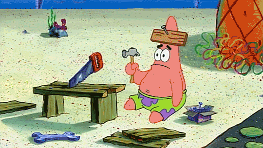

<figure>
  

  <figcaption>
    <small>
      Photo by
      <a href="https://unsplash.com/@lausteff?utm_source=unsplash&utm_medium=referral&utm_content=creditCopyText">
        Laurin Steffens
      </a>
      on
      <a href="https://unsplash.com/photos/3d-rendered-question-marks-in-orange-and-gray-IVGZ6NsmyBI?utm_source=unsplash&utm_medium=referral&utm_content=creditCopyText">
        Unsplash
      </a>
    </small>
  </figcaption>
  </figure>
# There Are No Stupid Questions... But There Are Not-Smart Questions

If your question is a "not smart" question, then you should probably expect a "not smart" answer.

For me, the quality of an answer often depends on the quality of the question. A good question gives the other person enough information to understand what you are trying to solve. A question with little thought or context can lead to an answer that is just as unclear.

## Smart Questions

A smart question helps answer the bigger question or solve the bigger problem. You put effort into the question, and you understand what you are asking. A smart question does not need to sound complicated. In fact, it can be very simple. What makes it smart is that it has a purpose. You have already thought about the problem, gathered some information, and figured out what part you do not understand.

For example, instead of asking:

> "Why doesn't my code work?"

You could ask:

> "Why does this function return `undefined` when I expect it to return a `number`?"

The second question gives a clear problem to investigate. It narrows down the issue and makes it easier for someone to give a useful answer.

## "Not Smart" Questions

For me, "not smart" questions are questions that are sudden, unexpected, or asked without much thought. They are not necessarily stupid questions. Sometimes you simply do not know enough about the topic yet to know what you should ask. However, a question becomes less useful when you ask someone to solve a problem without first trying to understand it yourself.

For example:

> "How do I make a website?"

That is a huge question. What kind of website? What language are you using? What are you trying to build? What have you already tried?

Without that information, the person answering has to guess what you actually need.

A "not smart" question is not necessarily bad; it can become a smart question by doing a little research, trying something first, and then asking about the specific part where you are stuck.

## Asking Better Questions

In software engineering, asking questions is normal. Nobody knows everything. The important part is learning how to ask questions that help you move forward. 

Before asking, I can ask myself with more micro-questions: 
- What am I trying to accomplish?
- What do I already know?
- What have I tried?
- Where exactly did I get stuck?
- How did this happened anyway?
- Why am I even asking this question?
- When to stop trying and move on?

Notice the micro-questions are mostly W's questions that supports the main question.

You do not need to know the answer before asking the question. If you already knew the answer, there would be no reason to ask. You just need to understand your problem well enough to ask a useful question.

A smart question shows that you are not only looking for an answer; You are trying to understand the problem.
