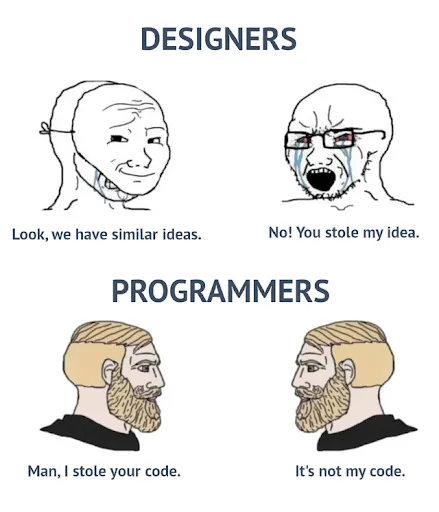

 
<small>
  Photo by
  <a href="https://unsplash.com/@vladimir_d?utm_source=unsplash&utm_medium=referral&utm_content=creditCopyText">
    Volodymyr Dobrovolskyy
  </a>
  on
  <a href="https://unsplash.com/photos/a-cat-sitting-in-front-of-a-computer-monitor-KrYbarbAx5s?utm_source=unsplash&utm_medium=referral&utm_content=creditCopyText">
    Unsplash
  </a>
</small>

 

# TypeScript, Timed Coding, and a Little Bit of Panic

When I hear "web development," I think of the trifecta: HTML, which structures what you see; CSS, which styles it; and JavaScript, which tells it what to do. Then, TypeScript. I had never heard of it before. I just learned in class that it's a superset of JavaScript. So what does it do? It does static typing. One more question: what is static typing? Does it make JavaScript more complicated?

Okay. I will break down those nested questions.

## What does it do? 

It does static typing. 

## What is “static typing”?

Let me explain this like I'm explaining it to a first-year ICS student or someone who has never coded before. Imagine you're a helicopter engineer who built a helicopter. It looks like a helicopter; it behaves like a helicopter, so it should be a helicopter, right? 

Now go to your pilot seat and fly it.

Will it break, or will it fly?

Then you hire a helicopter technician to check and he comments: “WAIT! The propeller is rotating the other way.” 

JavaScript is willing to run the program and see what happens. TypeScript checks your code before it runs and looks for places where you are using the wrong type of data.

For example, imagine a JavaScript function expects a number:

  function addScore(score) {
      return score + 10;
  }

Nothing stops me from accidentally doing this:

  addScore("John");

JavaScript may happily accept it until the program runs and produces something I did not expect.

With TypeScript, I can specify what kind of data the function accepts:

  function addScore(score: number) {
      return score + 10;
  }

Now if I try:

  addScore("John");

TypeScript can warn me before I run the program. I gave the function a string when it expected a number. That is static typing.

The technician is basically saying, “You told me this part is supposed to be a number. Why did you install a string here?”

## Does TypeScript make JavaScript more complicated?

**yes**

Instead of writing:

let score = 100;

I might write:

let score: number = 100;

There is more syntax to learn, and TypeScript can sometimes complain about code that JavaScript would happily run.

However, that extra complexity has a purpose. It can catch mistakes earlier, especially as a project grows.

So TypeScript makes JavaScript slightly more complicated while you're writing it, but it can make the overall program easier to understand, debug, and maintain.

In other words, JavaScript says:

“Looks good. Send it.”

TypeScript says:

“HOLD UP, WAIT A MINUTE.”

## TypeScript vs. Other Programming Languages

TypeScript's static typing is not a completely new idea. Other programming languages have been doing something similar for a long time.

Java, C, and C# are statically typed languages. When you create a variable, the program expects it to have a certain type.

For example, in Java:

  int score = 100;
  String name = "John";

You cannot suddenly do this:

  score = "John"; //*JAVA SCREAMS INTERNALLY*

Java will complain because `score` is supposed to be an integer, not a String.

C and C# work in a similar way. The type system is built into the language itself.

Python is different. Python is dynamically typed, like JavaScript. I can simply write:

  score = 100
  score = "John"

Python allows this. Modern Python does support optional type hints:

  score: int = 100

However, Python itself normally does not enforce that type while the program is running.

This is what makes TypeScript interesting. JavaScript started as a dynamically typed language, and TypeScript adds a static type-checking system on top of it.

So, in a very simplified way:

**JavaScript:** "Just give me the variable."

**Python:** "Same."

**TypeScript:** "What TYPE is the variable?"

**C / C# / Java:** "We have been asking that for years."

## WHAT IN THE "WOD"?

When I read the Morea website, I stumbled across some jargon I had never heard before. It was not programmer, military, or even gamer jargon. It was CrossFit jargon: WOD. Then there was the word "athletic." Whoa, are they going to train us for the Software Engineering Olympics? Nice!

WOD means "Workout of the Day” for non-CrossFitters like me, it basically means a quiz. (If I were the instructor, I would probably call my quizzes a "Confidence Course.") These WODs are timed coding exercises that usually give us around 30 minutes to complete a problem.

Oh boy, they are stressful, and they will probably become even more stressful when we have to do them as a group.

There are some good things about this style of learning. The biggest benefit is that it trains you to work under pressure. You cannot spend forever trying to make your code perfect. You have to understand the problem, develop a solution, test it, and submit it before time runs out. We are also allowed to use provided resources and our old notes, so the goal is not simply memorizing every piece of syntax.

The bad part is that there is not much time to polish the code. Bugs and quality have to be checked while you are working. During one WOD, for example, I remembered to check whether humidity was greater than 100, but I forgot to check whether it was less than 0. Small logical mistakes like that are easier to miss when the clock is ticking.

There is also less time to explain the code, clean up the syntax, or follow every coding convention perfectly. And, of course, there is always that one tiny syntax problem waiting for you.

However, I also learned that these exercises challenge us not to blindly trust the instructions. Sometimes we have to research the problem ourselves. In one WOD, we had to use a wind chill formula. The formula in the instructions had a formatting problem that made part of the equation look different from what was intended. I had to research the actual formula to make sure I implemented it correctly.

Overall, I think athletic software engineering can work for me. I would not call the WODs relaxing, but I can see their purpose. They force me to think faster, use the resources available to me, test my work as I go, and make decisions under pressure.

Maybe "athletic" is a fitting word after all. Instead of training muscles, we are training our programming skills through repeated practice.

No Software Engineering Olympics yet, though. sad trumpet noises 

## My Use of Generative AI

I mostly use generative AI to make sure my writing makes sense. I use it to check grammar, improve readability, and help me find sentences that might sound confusing.

**Boo!**

Hey, not nice. English is my second language.

I do not simply copy and paste the assignment instructions into a prompt and ask AI to do everything for me. I still come up with the ideas, examples, opinions, and experiences in my writing. I use AI more like a writing assistant that helps me communicate those ideas more clearly.

The same idea applies to programming. Generative AI is not a replacement for knowing how to code. It is a tool, and whoever holds the tool should know how to use it. If AI gives me code, I should still understand what that code does, test it, and recognize when something is wrong.

AI can also make mistakes. It can misunderstand what I am asking, give me unnecessary code, or produce something that simply does not work. That is why blindly trusting it defeats the purpose of learning.

Generative AI is not a replacement. It is a tool. And if the tool is bad, you can always replace it.

