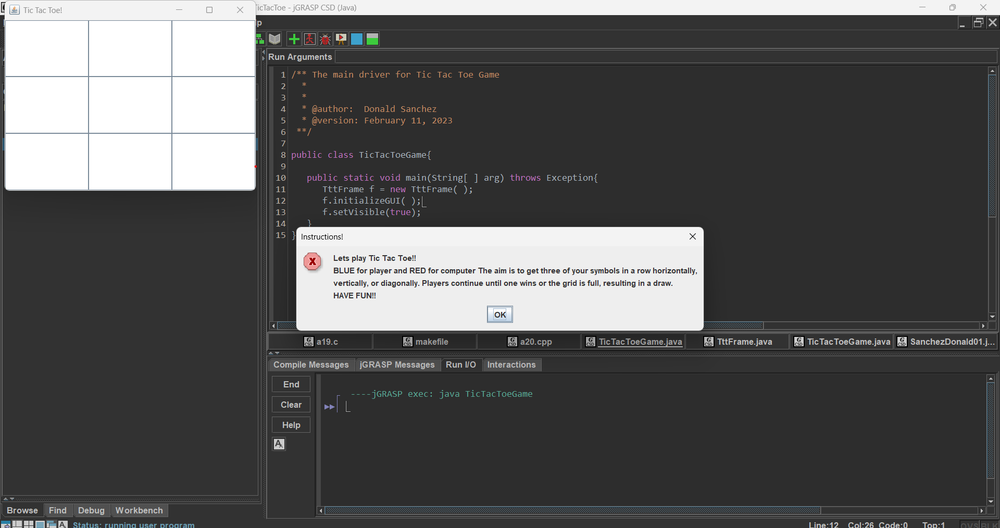

This simple TicTacToe game was one of my projects back in ICS 211 at Leeward Community College. I developed it through time, trial and error, and a lot of perseverance, without the help of AI. By the time I finished the project, it had grown to around 1,000 lines of Java code.

The game started as a basic TicTacToe program, but I little by little added more features as I worked on it. One of the main features is a crude opponent AI system that allows the player to play against the computer. While the AI is simple compared to what I could build today, creating it helped me learn how to turn game rules and decision-making into actual program logic.

The project also includes a save system that stores game data in a .txt file. This allowed me to practice reading and writing files in Java and keeping game information between sessions.

Looking back, the code is definitely not perfect. There are parts that I would organize and write differently today. However, this project represents an important stage in my programming experience. Completing roughly 1,000 lines of code taught me that I could work through bugs, build larger programs, and keep going even when a project became more complicated than I originally expected.

More importantly, this was a project I built before AI coding tools became part of my workflow. It serves as a snapshot of my programming skills at the time and shows how much I have learned since then.

